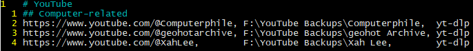

# `wcron`
## Explanation
`wcron` is a cron-like system for Windows. `cron` is the original on Unix/Linux, and this tries to (somewhat) mimic that on Windows, albeit with limited functionality, and only for media downloading.

`wcron` is a PowerShell script to download media from multiple sources to multiple destinations. This is something you can do using <a href="https://www.windowscentral.com/how-create-automated-task-using-task-scheduler-windows-10">Task Scheduler</a> already, but it's difficult to configure and maintain multiple downloads sources. `wcron` solves this issue by implementing a single task setup in Task Scheduler, which contains a `wcron` call with your "data source" files as arguments given to `wcron`. Then, simply add or remove download entries in your data source file(s).

## Execution
From the command line, a typical `wcron` call would look like this:

    & wcron.ps1 "~/YouTube Videos.wcron"

Multiple data source files provided as arguments are supported.

## Configuration Syntax
Config files must look like this.

Format: `URL, destination write path, executable`

Each entry is commma delimited. Tabs are allowed between commas and the start of new entries, as shown in the image.

Comments can be invoked using the `#` character at the start of a line.

## TODO
- [] Executables should be dynamically received. Execs should be able to contain
args.
- [] Improve status text.